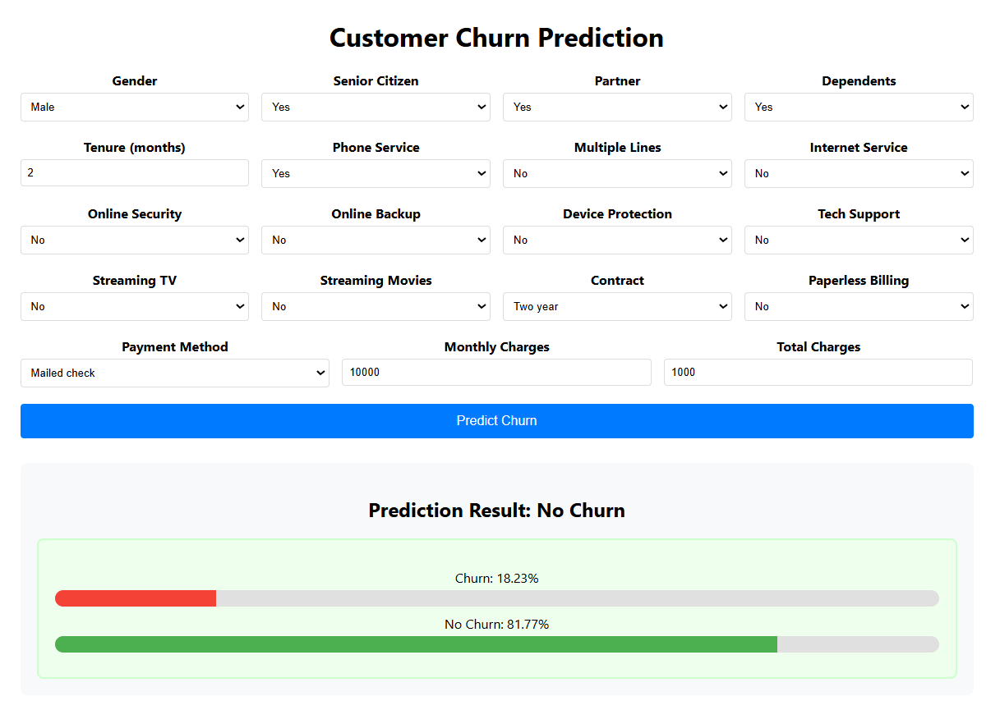

# Customer Churn Prediction

Machine learning project for predicting customer churn using XGBoost, Random Forest, and Decision Tree models. The project includes a FastAPI backend and React TypeScript frontend for model deployment.

## Dataset

[Telco Customer Churn Dataset](https://www.kaggle.com/datasets/blastchar/telco-customer-churn) from Kaggle

## Dependencies Installation

### Option 1: Conda Environment (Recommended)
```bash
conda env create -f churn_prediction_env.yaml
conda activate churn_prediction_env
```

### Option 2: pip Requirements
```bash
pip install -r requirements.txt
```

## Application Installation

### Prerequisites

1. **Repository files**: Download the repository as ZIP and extract it
2. **Python**: Install it
3. **Docker Desktop**: Install and run it before using docker-compose

### Option 1: Normal Python

**Backend:**
```bash
cd backend
uvicorn app:app --reload
```

**Frontend:**
```bash
cd frontend
npm install  # First time only - installs dependencies
npm start    # Starts the development server
```

### Option 2: Docker

```bash
docker-compose up --build
```

For detailed Docker setup, see [DOCKER_README.md](DOCKER_README.md)

## Images

<table>
<tr>
<td></td>
<td></td>
</tr>
<tr>
<td align="center">Churn</td>
<td align="center">No Churn</td>
</tr>
</table>

## Deployment Tips
To deploy this application publicly (not just localhost), use hosting services like **Railway**, **Render**, **Heroku**, or **AWS**.

For **Render**:
- Build the FastAPI backend for production with
  ```console
  # Root Directory
  ./
  # Build Command
  pip install -r backend/backend-requirements.txt
  # Start Command
  uvicorn backend.app:app --host 0.0.0.0 -port $PORT
  ```
- Build the React frontend for production with
  ```console
  # Root Directory
  ./frontend
  # Build Command
  npm install && npm run build`
  ```
- Consider using environment variables for configuration
  - `REACT_APP_API_URL` used in `frontend/src/services/api.ts`
  - `PYTHON_VERSION` used in `backend/runtime.txt`
- Update CORS settings in `backend/app.py` to allow the production domain [add the Render deployed frontend URL]
- Ensure model files are accessible (include in deployment or use cloud storage)

### Local Host
- Frontend: http://localhost:3000
- Backend API: http://localhost:8000
- API Docs: http://localhost:8000/docs

### Current Public Host
- Frontend: https://hexsoftwares-customer-churn-prediction.onrender.com
- Backend API: https://hexsoftwares-churn-prediction.onrender.com
