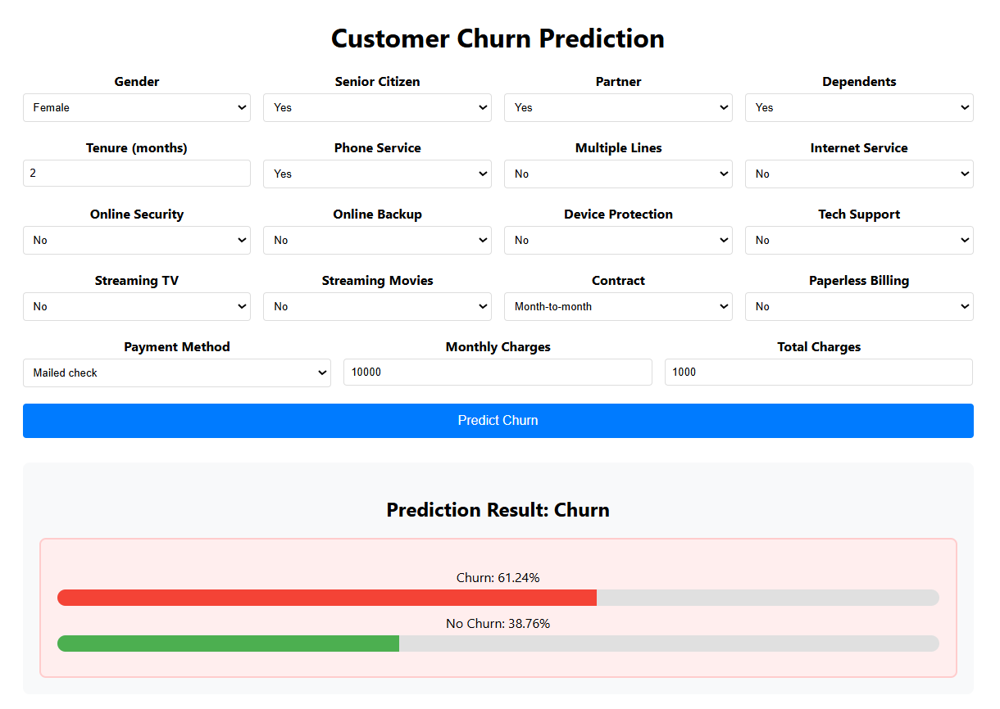
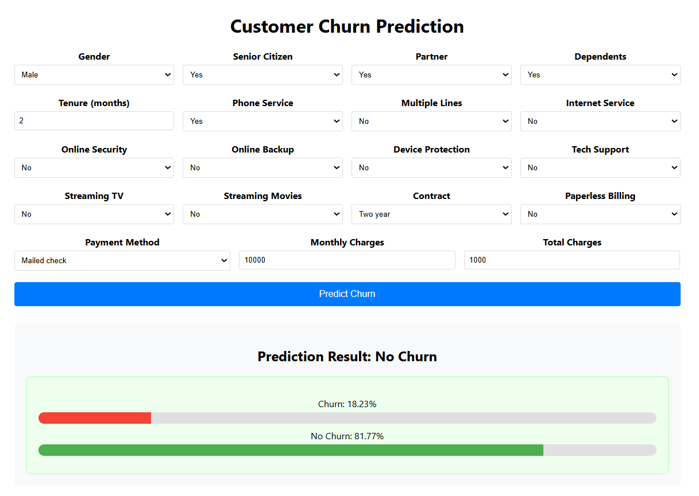

# Customer Churn Prediction

Machine learning project for predicting customer churn using XGBoost, Random Forest, and Decision Tree models. The project includes a FastAPI backend and React TypeScript frontend for model deployment.

## Dataset

[Telco Customer Churn Dataset](https://www.kaggle.com/datasets/blastchar/telco-customer-churn) from Kaggle

## Project Structure

```
root/
├── backend/              # FastAPI
├── data/                 # Dataset files (raw and processed)
├── frontend/             # TypeScript files
├── images/               # Example screenshots
├── models/               # Trained model files
├── notebooks/            # Jupyter notebooks for model development and analysis
└── preprocessors/        # Saved preprocessors
```

## Models Explored

The project compares three model architectures:

1. **Decision Tree**: Baseline model with interpretable rules and non-linear boundaries, useful for identifying main churn drivers.
    - Trained on SMOTE-balanced training data.

2. **Random Forest**: Bagging ensemble of decision trees to reduce overfitting and capture feature interactions.
    - Trained on SMOTE-balanced training data.

3. **XGBoost**: Gradient boosting for strong predictive performance and complex interactions, well-suited to imbalanced targets.
    - Trained on SMOTE-balanced training data.

## Project Workflow

### Phase 1: Baseline Compairson

- Encoded categorical features (binary and one-hot) and applied SMOTE on the training set only to balance classes before model comparison.
- Trained all three models on the same SMOTE-balanced training data.
- Compared models with regular 5-fold and stratified 5-fold cross-validation using accuracy as the metric.
- Random Forest had the highest CV accuracy; after final training and test evaluation, XGBoost performed best on the test set, so XGBoost was chosen for Phase 2.

### Phase 2: Hyperparameter Tuning

- Tuned XGBoost in two steps:
    1. `GridSearchCV` for `n_estimators` and `learning_rate`,
    2. `RandomizedSearchCV` for `max_depth`, `gamma`, `min_child_weight`, regularization, and sampling parameters.
- Kept accuracy as the tuning metric.
- Saved the best-tuned XGBoost model for deployment.

## Dependencies Installation

### Option 1: Conda Environment (Recommended)
```bash
conda env create -f churn_prediction_env.yaml
conda activate churn_prediction_env
```

### Option 2: Pip
```bash
pip install -r requirements.txt
```

## Application Installation

### Prerequisites

1. **Repository files**: Download the repository as ZIP and extract it
2. **Python**: Install it
3. **Docker Desktop**: Install and run it before using docker-compose

### Option 1: Normal Python

**Backend:**
```bash
cd backend
uvicorn api:app --reload
```

**Frontend:**
```bash
cd frontend
npm install  # First time only - installs dependencies
npm start    # Starts the development server
```

### Option 2: Docker

```bash
docker-compose up --build
```

For detailed Docker setup, see [DOCKER_README.md](DOCKER_README.md)

## Images

<table>
<tr>
<td></td>
<td></td>
</tr>
<tr>
<td align="center">Churn</td>
<td align="center">No Churn</td>
</tr>
</table>

## Deployment Tips

To deploy this application publicly (not just localhost), use hosting services like **Railway**, **Render**, **Heroku**, or **AWS**.

For **Render**:
- Build the FastAPI backend for production with
  ```console
  # Root Directory
  ./
  # Build Command
  pip install -r backend/backend-requirements.txt
  # Start Command
  uvicorn backend.api:app --host 0.0.0.0 -port $PORT
  ```
- Build the React frontend for production with
  ```console
  # Root Directory
  ./frontend
  # Build Command
  npm install && npm run build
  # Publish Directory
  ./frontend/build
  ```
- Consider using environment variables for configuration
  - `REACT_APP_API_URL` used in `frontend/src/services/api.ts`
  - `PYTHON_VERSION` used in `backend/runtime.txt`
- Update CORS settings in `backend/api.py` to allow the production domain [add the Render deployed frontend URL]
- Ensure model files are accessible (include in deployment or use cloud storage)

### Local Host

- Frontend: http://localhost:3000
- Backend API: http://localhost:8000
- API Docs: http://localhost:8000/docs

### Current Public Host

- Frontend: https://hexsoftwares-customer-churn-prediction.onrender.com
- Backend API: https://hexsoftwares-churn-prediction.onrender.com
- API Docs: https://hexsoftwares-churn-prediction.onrender.com/docs
